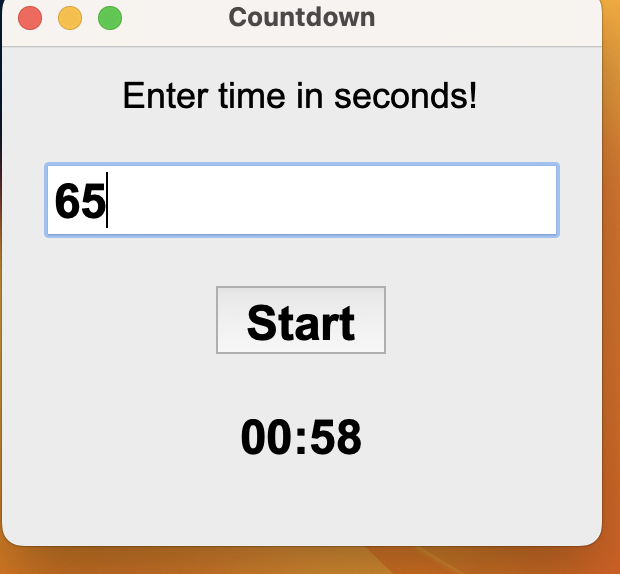
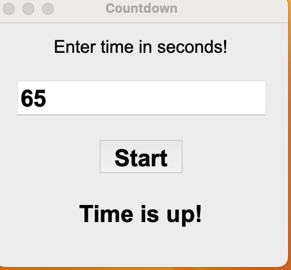

# Countdown App

The goal of this project is creating an app for countdown in seconds.

## Description

User can enter time in seconds and click start button. After clicking the button countdown will begin on the screen.
It will change dynamically until countdown finishes. Once it finish, 'Time is up!' warning will come up.





## Getting Started

### Dependencies

* You can find all the libraries and version information used on this project in requirements.txt.
* It is required Python 3.10 or greater versions.
* Tkinter module should be installed.

### Installing

* The following command will install the packages according to the configuration file
* $ pip3 install -r requirements.txt

### Executing program

* First I created ui part to get the user input and to show the countdown. There is an Entry widget user can enter time 
  in seconds. Below code block creates the main frame, entry widget and label for this entry.


```
root = Tk()
root.geometry('300x250')
root.title('Countdown')

widget_lbl = Label(root, font=('Arial', 18), text='Enter time in seconds!')
widget_lbl.pack(padx=20, pady=10)
widget = Entry(root, font=('Arial', 24, 'bold'),
               background='white', foreground='black')
widget.pack(padx=20, pady=10)
   
```

* After creating the first ui part, submit function is created. This function retrieves the user input and cast this 
  string to integer. There is function call at the last line and this second function takes 'seconds' variable as parameter.

```
def submit():
    time_sec = widget.get()
    seconds = int(time_sec)
    countdown(seconds)

```

* Second function is countdown function. Divmod() returns minute and seconds version of the entry. First parameter is the
  quotient of entry and secs is the remainder of division by 60. Timer variable is the formatted version of this time variables.
  After format variables, label widget takes formatted variables as text. There is an if/else logic, if seconds greater than zero,
  label widget which I define after this function, waits 1 seconds and calls countdown function reducing the number by one.
  Once seconds equals to zero it will stop and label text will show 'Time is up!' text instead of countdown value.


```
def countdown(seconds):
    mins, secs = divmod(seconds, 60)
    timer = '{:02d}:{:02d}'.format(mins, secs)
    lbl.config(text=timer)
    if seconds > 0:
        lbl.after(1000, countdown, seconds - 1)
    else:
        lbl.config(text='Time is up!')
```


* The last part consists of button and label widget creation. For the button, command parameter calls the 'Submit' function
  when user clicks it. Submit function calls the countdown function and the countdown function formats time, starts countdown. 
  The mainloop() method puts every item on the display and responds to user input until the program terminates.


```
button = Button(root, font=('Arial', 24, 'bold'),
                text='Start', command=submit)
button.pack(padx=20, pady=10)
lbl = Label(root, font=('Arial', 24, 'bold'), foreground='black')
lbl.pack(padx=20, pady=10)
mainloop()     
```
